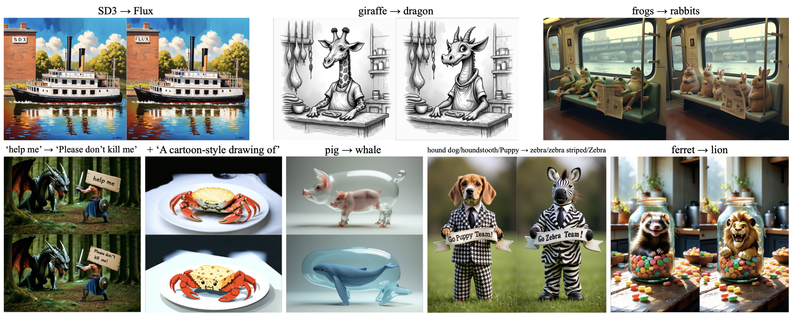

# Exploring MM-DiT

<p align="center">
  
</p>

<br/>

PyTorch implementation of **"Exploring Multimodal Diffusion Transformers for Enhanced Prompt-based Image Editing"** (ICCV 2025).

<p align="center">
  <a href="https://arxiv.org/abs/2409.08857"></a>
  <a href="https://joonghyuk.com/exploring-mmdit-web/"></a>
</p>

---

## Overview

This repository provides utilities for prompt-based image editing on Multimodal Diffusion Transformers (MM-DiT), including Stable Diffusion 3, Stable Diffusion 3.5, and Flux.

The `utils/` folder contains:
- `dit_utils.py` - Core editing utilities for DiT models (SD3, SD3.5, Flux)
- `unet_utils.py` - Core (P2P) editing utilities for U-Net models (SDXL)
- `attn_processors.py` - Custom attention processors for QKV control
- `dit_attn_viz.py` - Attention map visualization tools
- `common.py` - Shared utilities

## Setup

Tested with `diffusers==0.36.0` and `transformers==4.57.3`, but the code is mostly self-contained and should work with any environment capable of running Flux and SD3.

```bash
pip install diffusers transformers accelerate sentencepiece protobuf
```

## Quick Start

Our method replaces image queries and keys $(q_i, k_i)$ between source and target during generation. We recommend using `method="qiki"` with local blending for best results. For detailed usage and effect of each parameter, please refer to our paper and [`examples/`](examples/).

```python
import torch
from diffusers import FluxPipeline
from utils import register_qkv_control, create_qkv_controller, p2p_callback, TOP5_BLOCKS

pipe = FluxPipeline.from_pretrained(
    "black-forest-labs/FLUX.1-dev", torch_dtype=torch.bfloat16
).to("cuda")

prompts = [
    "translucent pig, inside is a smaller pig.",
    "translucent whale, inside is a smaller whale.",
]

controller = create_qkv_controller(
    pipeline_type="flux",
    prompts=prompts,
    num_inference_steps=28,
    tokenizer=[pipe.tokenizer, pipe.tokenizer_2],
    device=pipe.device,
    dtype=pipe.dtype,
    method="qiki",
    local_blend_words=[["pig,", "pig."], ["whale,", "whale."]],
    local_blend_threshold=0.3,
    aggregate_blocks=TOP5_BLOCKS["flux-dev"],
    t5_max_seq_len=512,
    height=768,
    width=1344,
)

register_qkv_control(pipe, controller)
images = pipe(
    prompt=prompts,
    num_inference_steps=28,
    guidance_scale=3.5,
    height=768,
    width=1344,
    max_sequence_length=512,
    generator=[torch.Generator().manual_seed(12341234), torch.Generator().manual_seed(12341234)],
    callback_on_step_end=p2p_callback,
    callback_on_step_end_tensor_inputs=["latents"],
).images

controller.reset()
# images[0] = source (pig), images[1] = edited (whale)
```

## Examples

See [`examples/`](examples/) for Jupyter notebooks demonstrating various use cases:
- `flux_dev_editing.ipynb` - Flux-dev examples
- `flux_schnell_editing.ipynb` - Flux-schnell (4-step) examples
- `sd35l_editing.ipynb` - SD3.5-large examples
- `sd35m_editing.ipynb` - SD3.5-medium examples
- `sd35l_turbo_editing.ipynb` - SD3.5-large-turbo examples
- `sd3m_editing.ipynb` - SD3-medium examples
- `sdxl_editing.ipynb` - SDXL examples (U-Net)
- `attention_visualization.ipynb` - Visualizing attention maps

## Notes

This codebase was refactored from the original research code to be compatible with recent diffusers and transformers versions. LLMs were used in some portions of the refactoring process. If you encounter any issues, please let us know via [GitHub Issues](https://github.com/SNU-VGILab/exploring-mmdit/issues).

## BibTeX

If you find this work useful, please cite:

```bibtex
@inproceedings{shin2025exploringmmdit,
  title     = {{Exploring Multimodal Diffusion Transformers for Enhanced Prompt-based Image Editing}},
  author    = {Shin, Joonghyuk and Hwang, Alchan and Kim, Yujin and Kim, Daneul and Park, Jaesik},
  booktitle = {Proceedings of the IEEE/CVF International Conference on Computer Vision (ICCV)},
  year      = {2025}
}
```
