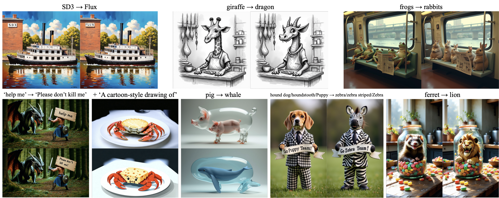

# Exploring Multimodal Diffusion Transformers for Enhanced Prompt-based Image Editing

<p align="center">
  
  <br/>
  <em>ICCV 2025</em>
</p>

<p align="center">
  <a href="https://arxiv.org/abs/2508.07519"></a>
  <a href="https://joonghyuk.com/exploring-mmdit-web/"></a>
</p>

---

## Code

**Coming Soon!**

---

## BibTeX

```
@inproceedings{shin2025exploringmmdit,
  title     = {{Exploring Multimodal Diffusion Transformers for Enhanced Prompt-based Image Editing}},
  author    = {Shin, Joonghyuk and Hwang, Alchan and Kim, Yujin and Kim, Daneul and Park, Jaesik},
  booktitle = {Proceedings of the IEEE/CVF International Conference on Computer Vision (ICCV)},
  year      = {2025}
}
```
